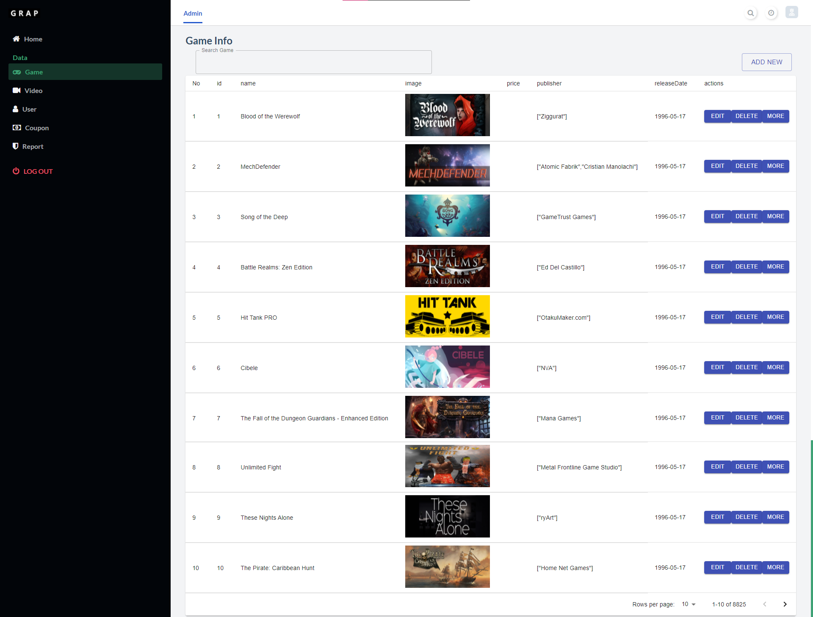
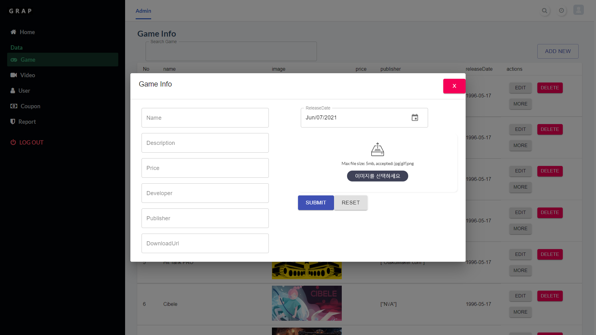
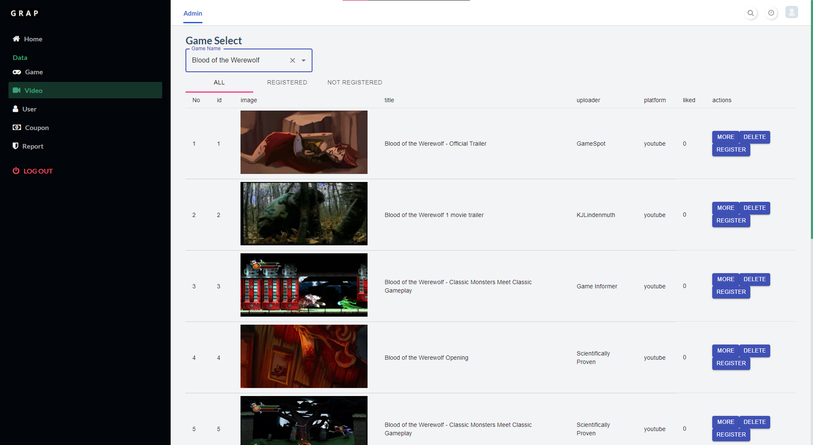
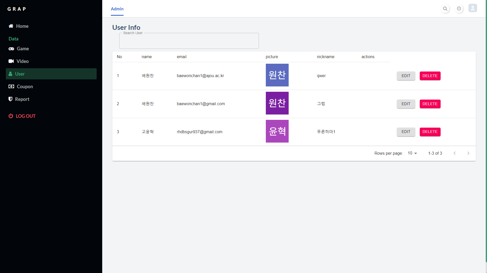
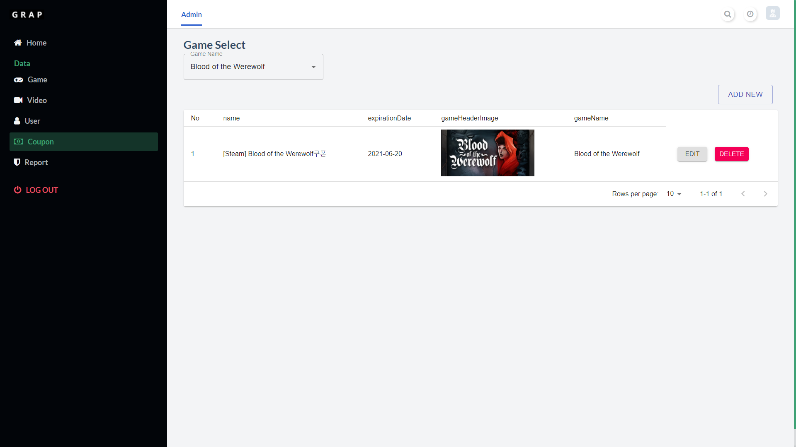
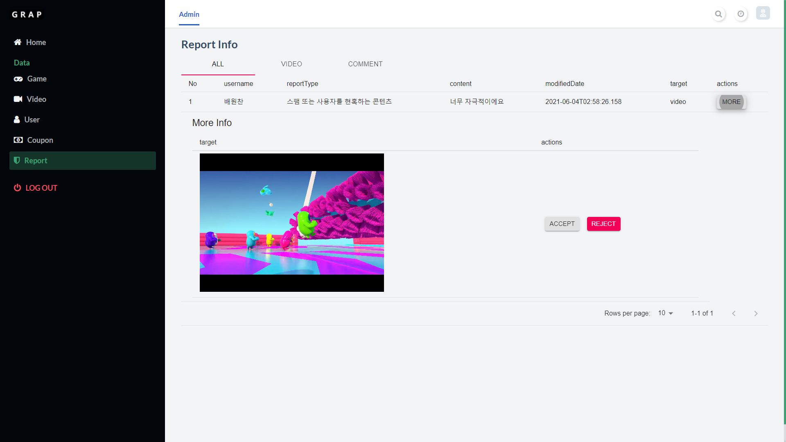

# GRAP_Admin
- [GRAP_FrontEnd](https://github.com/Frame-GRAP/GRAP_FrontEnd)  
- [GRAP BackEnd](https://github.com/Frame-GRAP/GRAP_BackEnd)  
- [GRAP_RecommendationSystem](https://github.com/Frame-GRAP/GRAP_RecommendationSystem)
----------------------------------------------------------------
## 목차
[1. 개요](#1-개요)  
[2. 시스템 개요](#2-시스템-개요)  
[3. 빌드](#3-빌드)  
[4. 페이지 구성](#4-페이지-구성)  
[5. 소개 영상](#5-소개-영상)
## 1. 개요
> 최근 게임 산업의 전례없는 흥행으로 인해 게임을 즐기는 인구의 비율이 나날이 늘어가고 있다. 이에 따라 새로운 게임에 대한 수요 또한 증가하고 있으나, 현재 새로운 게임을 소개 및 추천하는 전문 플랫폼이 없고, 대체 수단인 스팀 등의 온라인 게임 다운로드 플랫폼에서는 단순한 이미지, 짧은 영상으로 게임을 소개하고 있어 그 기능을 제대로 수행하지 못한다. 이에 따라 기존의 문제점을 적극적으로 해결할 방안으로 넷플릭스의 맞춤 추천에 효율적인 UI/UX, 실제 게임 플레이 영상, 머신러닝을 이용한 개인별 맞춤화 게임 추천 서비스를 융합하여 유익한 정보와 더 나은 추천을 제공하는 플랫폼인 ‘GRAP’을 기획하게 되었다.
## 2. 시스템 개요


과제 수행 내용으로는, 먼저 AWS EC2, S3, RDS 및 Spring을 사용하여 백엔드를, React를 사용하여 프론트엔드를 개발하고, Travis CI, CodeDeploy를 활용하여 DevOps를 구축한다. 또한 Jsoup, Selenium으로 영상 크롤링을 구현한다. 추천 알고리즘으로는 hybrid filtering을 사용하여 content-based filtering 기법으로 초기의 cold-start 문제를 해결하고, 이 후 collaborative filtering 기법으로 보다 향상된 개인별 맞춤화 추천 서비스를 구현한다.

## 3. 빌드
* Clone
```
git clone https://github.com/Frame-GRAP/GRAP_Admin.git
```

* Change Directory
```
cd GRAP_FrontEnd
```

* Install & Run
```
npm install
```

* Run
```
npm start
```


## 4. 페이지 구성
### 1. 게임 관리



+ 등록된 게임 관리



+ 새로운 게임 등록

### 2. 비디오 관리



+ 각 게임 별 영상 확인 후 관리

### 3. 유저 관리



+ 유저 정보 수정 및 삭제

### 4. 쿠폰 관리



+ 쿠폰 발급 및 수정 삭제 가능


### 5. 신고 관리



+ 신고 내용 확인 및 처리

이 외 유저 기능은 아래 레포지토리에 소개되어 있습니다.  
[GRAP_FrontEnd](https://github.com/Frame-GRAP/GRAP_FrontEnd)  


## 5. 소개 영상
https://softcon.ajou.ac.kr/works/works.asp?uid=425
